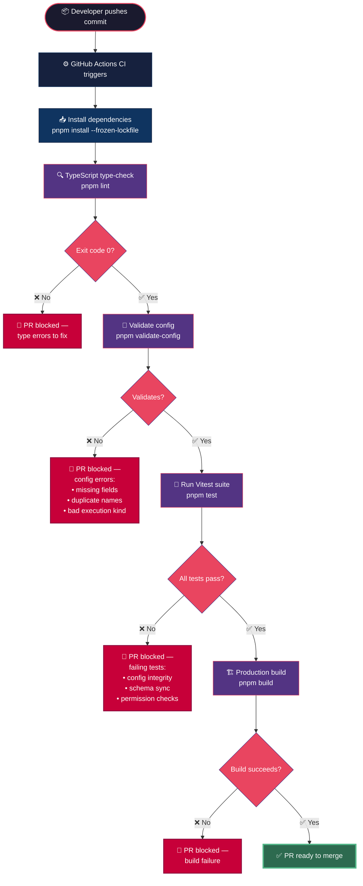

# MCP CI Pipeline Flow

## Validation Detail

### Gate: `pnpm validate-config` (`scripts/validate-mcp-config.ts`)

Checks that `mcp-config.json` conforms to these rules:

| Check | Details |
|-------|---------|
| **Required fields** | Every tool must have `name`, `description`, `parameters`, `executionKind`, `filePath`, `sourceModule`, `category` |
| **Name uniqueness** | No duplicate tool names allowed |
| **Name pattern** | Must match `[a-z][a-z0-9_]*` |
| **Execution kind** | One of `browser-context`, `server-context`, `hybrid` |
| **Category** | Must be a known category from `VALID_CATEGORIES` — unknown entries produce warnings |
| **Parameters** | Must have `type: "object"`, `properties` must be an object, `required` must be an array if present |

### Gate: `pnpm test` (`services/mcp-config.test.ts`)

The Vitest suite covers three groups of tests:

**Config Integrity** — 7 test cases:
- File exists and parses as valid JSON
- Version is `1.0.0`
- At least 90 tools defined
- Each tool has all required fields with correct types
- Tool names are unique and match naming pattern
- `filePath` values point to real files on disk
- Well-known tools present (e.g., `navigate`, `web_search`, `generate_image`)

**Schema Sync** — 7 test cases:
- `VALID_CATEGORIES` matches the JSON schema category `enum`
- `VALID_EXECUTION_KINDS` matches the schema executionKind `enum`
- Required fields in schema match validator error checks
- No duplicates in either location
- Validator runs and exits 0
- Tool count in output matches parsed config count

**Permissions** — 10 test cases:
- All permission values use `namespace:action` format
- Browser tools declare `screen:share` + `control:grant`
- CDP-only tools only require `cdp:connected`
- Gmail tools require `google:auth`; `send_gmail` also `gmail:send`
- Spotify tools require `spotify:auth`
- Obsidian tools declare `vault:read` or `vault:write`
- `browser_complete_task` also declares `gemini:vision`

---

*See [MCP_SPEC.md](../docs/05_MCP/MCP_SPEC.md#ci-pipeline--validation-gates) for the full prose specification.*
