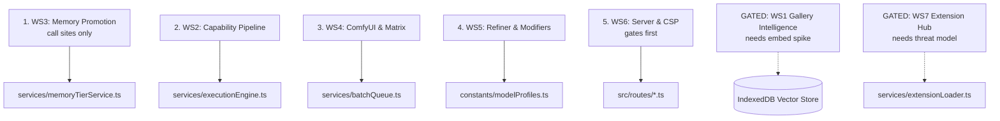
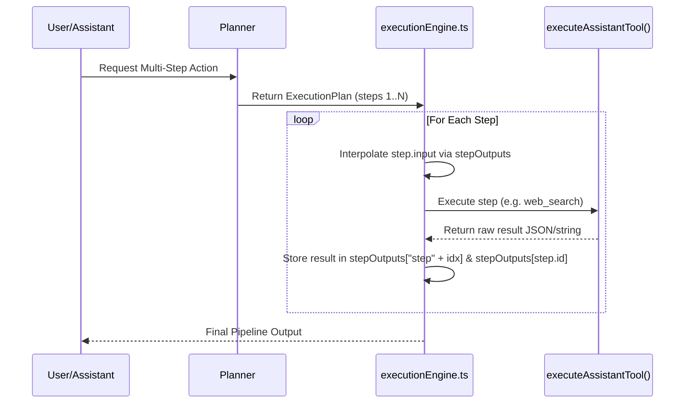
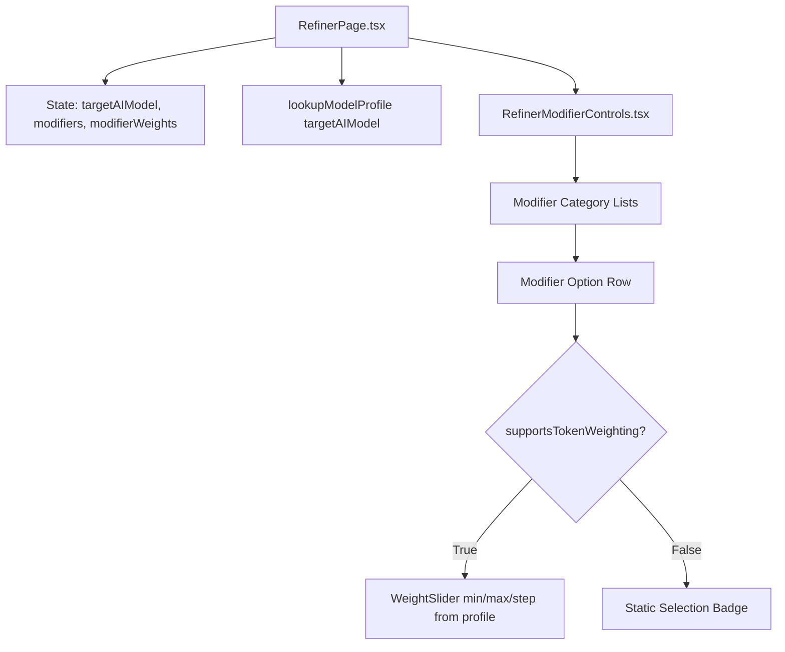

# Kollektiv — Phase 5 Technical Architecture & Implementation Specification

**Document Version:** 3.0.0 (Revised after code review)
**Date:** 2026-07-29
**Status:** Revised — sequenced, two workstreams gated
**Target Repository:** `Kollektiv`
**Supersedes:** 2.1.0 (2026-07-28)

**Reference Architecture:**

- [docs/handbook/README.md](../handbook/README.md)
- [docs/handbook/docs/00_FOUNDATION/ARCHITECTURE_CONSTITUTION.md](../handbook/docs/00_FOUNDATION/ARCHITECTURE_CONSTITUTION.md)
- [docs/handbook/docs/01_AI_ENGINE/AI_ENGINE.md](../handbook/docs/01_AI_ENGINE/AI_ENGINE.md)
- [docs/handbook/docs/04_MEMORY/MEMORY_SYSTEM.md](../handbook/docs/04_MEMORY/MEMORY_SYSTEM.md)
- [docs/ISSUES.md](../ISSUES.md)

---

## ⚠️ What changed from 2.1.0, and why

Version 2.1.0 was reviewed against the actual codebase on 2026-07-29. Six findings forced a revision. They are recorded here rather than silently corrected, because two of them would have made the code worse if implemented as written.

| # | Finding | Change in 3.0.0 |
|---|---|---|
| 1 | **WS3 proposed rewriting code that already exists and works.** `memoryTierService.trackAccess()` is fully implemented at `services/memoryTierService.ts:176` with configurable thresholds. The 2.1.0 replacement had the wrong signature, called two helpers (`getMemoryById`, `saveMemories`) that **exist nowhere in the repo**, and hardcoded the same 3/10 values that are already configurable defaults. | Rewrite deleted. WS3 is now call-site wiring only. |
| 2 | **Four file paths were wrong**, so patches would not have applied. | Corrected; see the path table below. |
| 3 | **WS7's "sandbox" is not a security boundary.** A Web Worker shares the page origin and has a global `fetch`; a `networkAllowlist` on the bridge API does not constrain it. | WS7 gated behind a written threat model. Not scheduled. |
| 4 | **WS1 rests on an unverified assumption** — that Ollama's `/api/embed` accepts images. The contract verified live on 2026-07-28 is text-only (`{model, input}` → `{embeddings:[[…]]}`). | WS1 gated behind a one-hour verification spike. |
| 5 | **WS6 treated the CSP switch as a one-line edit.** It is blocked on five unrun manual verifications (ISSUE-30 items 1–5). | Reframed as "run the gates, then flip". |
| 6 | **WS5 added a registry parallel to one that already exists** in the same file (`lookupModelProfile`). | Changed to extend the existing profile schema. |

### Prerequisite that outranks this entire document

`docs/ISSUES.md` carries **31 unchecked manual-verification boxes**, and Phases 0–4 in the handbook are all marked ✅ without those gates ever being run. Prod CSP is still `Content-Security-Policy-Report-Only`.

Phase 5 adds surface area on top of unverified ground. That is the same defect class this project has already hit three times (auto-tagging claimed shipped but unreachable; ComfyUI passing mocks while broken live; the capability platform returning `"dispatched (stub)"`). **Closing verification debt should precede WS1, WS4, WS5, and WS7.** WS2 and WS3 are safe to run in parallel with it — they touch subsystems the gates do not cover.

---

## 🧭 Executive Overview

Phase 5 covers **five scheduled workstreams and two gated ones**, ordered by risk-adjusted value: smallest correct change first, largest unknown last.



### Corrected path table

| 2.1.0 said | Actual |
|---|---|
| `services/tools/galleryTools.ts` | Does not exist — gallery tools are inline in `services/assistantTools.ts` |
| `components/gallery/ItemDetailView.tsx` | `components/ItemDetailView.tsx` |
| `utils/promptUtils.ts` | Does not exist — put serialization in `constants/modelProfiles.ts` beside its registry |
| `server.ts` "~1,500 lines" | 1,792 lines |

---

# Scheduled Workstreams

---

## 1. WS3 — Memory Promotion: Wire the Call Sites

### 1.1 Corrected diagnosis

2.1.0 said promotion is "dormant due to zero call sites for `trackAccess()`". Half right. The precise state:

- `knowledgeService.touchAccess()` (`services/knowledgeService.ts:312`) **does run** — `recall()` calls it at line 324, and `recall()` is called from `services/assistantTools.ts:883`. **Access counts already increment.**
- `memoryTierService.trackAccess()` (`services/memoryTierService.ts:176`) is the wrapper that increments *and then evaluates promotion thresholds*. It has **zero callers**.

So the bug is not a missing counter. It is that **nothing ever evaluates the promotion rules**. Counts climb forever; a memory accessed 50 times stays in `working`.

### 1.2 What already exists — do not rewrite

```ts
// services/memoryTierService.ts:176 — ALREADY IMPLEMENTED, keep as-is
async trackAccess(ref: KnowledgeRef): Promise<KnowledgeRef>
```

Handles both promotion hops. Thresholds are configurable, already defaulting to the intended values:

```ts
// services/memoryTierService.ts:51-52
working:  { minAccessCount: 3,  autoPromote: true },
longTerm: { minAccessCount: 10, autoPromote: true },
```

The 2.1.0 code block for this file is **deleted from this spec**. It would have replaced working, configurable, async, `KnowledgeRef`-based logic with a non-compiling sync stub using two nonexistent helpers.

### 1.3 The actual change

Route recall paths through the promotion-aware wrapper instead of the raw counter.

- **`services/assistantTools.ts:883` [MODIFY]** — the one confirmed live call site:

  ```ts
  // before
  const content = await knowledgeService.recall(ref);

  // after — same recall, but promotion thresholds now evaluate
  await memoryTierService.trackAccess(ref);
  const content = await knowledgeService.recall(ref);
  ```

  Note `recall()` still calls `touchAccess()` internally, so this double-counts a single access. Pick one of two fixes and apply it consistently:
  - **(a)** drop `this.touchAccess(ref)` from `knowledgeService.recall()` and let `trackAccess()` own counting, or
  - **(b)** have `trackAccess()` evaluate thresholds without incrementing, and leave counting to `recall()`.

  **(b) is preferred** — it keeps counting in one place and makes `trackAccess` a pure policy check. It requires splitting the increment out of `memoryTierService.trackAccess()`.

- **Additional call sites to wire** (each needs a `KnowledgeRef`, so confirm one is in scope before adding):
  `searchMemories()` result selection, gallery asset detail open, `memoryPromptBlock()` injection.

### 1.4 Tests

`services/memoryTierService.test.ts` [MODIFY] — assert that a ref crossing `minAccessCount` promotes exactly once, that a promoted ref does not re-promote, and that **an access is counted once per recall, not twice** (the regression the fix above is guarding).

---

## 2. WS2 — Capability Platform: Inter-Step Data Flow

Unchanged from 2.1.0 — this was the strongest section and the design is sound. It closes a gap independently confirmed during the ISSUE-47 review: plan steps execute correctly but cannot consume each other's output.

### 2.1 Execution engine state & interpolation

In [services/executionEngine.ts](../../services/executionEngine.ts):

```typescript
export interface StepExecutionContext {
  stepId: string;
  stepType: string;
  status: "pending" | "running" | "completed" | "failed" | "skipped";
  input: Record<string, any>;
  output?: any;
  error?: string;
  durationMs?: number;
}

export interface PipelineExecutionState {
  planId: string;
  steps: StepExecutionContext[];
  stepOutputs: Record<string, any>; // Keyed by stepId and step index ('step1', 'step[0]')
}

/**
 * Resolves template expressions such as "{{step1.output.summary}}" or "{{step[0].output}}"
 */
export function interpolateStepValue(
  value: unknown,
  outputs: Record<string, any>,
): unknown {
  if (typeof value !== "string") return value;
  const templateRegex = /\{\{\s*([a-zA-Z0-9_\[\]\.]+)\s*\}\}/g;

  // Exact match replacement (preserves object/array types)
  const exactMatch = value.match(/^\{\{\s*([a-zA-Z0-9_\[\]\.]+)\s*\}\}$/);
  if (exactMatch) {
    return getNestedProperty(outputs, exactMatch[1]) ?? value;
  }

  // String interpolation for embedded templates
  return value.replace(templateRegex, (_, path) => {
    const resolved = getNestedProperty(outputs, path);
    return typeof resolved === "object"
      ? JSON.stringify(resolved)
      : String(resolved ?? "");
  });
}
```

Exact-match returning the raw value (rather than a stringified one) is the load-bearing detail — it lets a step pass an object or array forward without a JSON round-trip.

### 2.2 Dispatch workflow



### 2.3 Integration constraints

- The existing 18 tests in `services/executionEngine.test.ts` must keep passing unmodified. In particular, a tool returning an `"Error:"` string must still **fail** its step — interpolation must not swallow that.
- Unresolved templates: `getNestedProperty` returning `undefined` falls back to the literal template string on exact match, and to `""` on embedded match. Decide deliberately whether an unresolved template should instead **fail the step** — silently substituting `""` into a prompt is the kind of failure that looks like success. Recommendation: fail the step.

---

## 3. WS4 — ComfyUI Custom Workflows & Parameter Matrix

### 3.1 Rationale

`services/comfyService.ts` builds a standard SD1.5/SDXL payload only. That is deliberate — the default workflow wires off `CheckpointLoaderSimple`'s bundled CLIP/VAE outputs, which is correct for standard checkpoints and wrong for split-encoder models (Flux, SD3). Custom workflow import is the designed escape hatch for those, and for IP-Adapter/ControlNet/AnimateDiff graphs.

### 3.2 Workflow parsing engine

- **`services/comfyWorkflowParser.ts` [NEW]**:

  ```typescript
  export interface ComfyNodeTarget {
    nodeId: string;
    fieldPath: string; // e.g. "inputs.text" or "inputs.seed"
  }

  export interface ComfyWorkflowSchema {
    workflowName: string;
    rawPromptJson: Record<string, any>;
    targetInputs: {
      positivePrompt: ComfyNodeTarget[];
      negativePrompt: ComfyNodeTarget[];
      seed: ComfyNodeTarget[];
      steps: ComfyNodeTarget[];
      cfg: ComfyNodeTarget[];
      samplerName: ComfyNodeTarget[];
    };
  }

  export function injectWorkflowParameters(
    schema: ComfyWorkflowSchema,
    params: { prompt: string; negativePrompt?: string; seed?: number },
  ): Record<string, any> {
    const cloned = JSON.parse(JSON.stringify(schema.rawPromptJson));
    for (const target of schema.targetInputs.positivePrompt) {
      setNestedPath(cloned[target.nodeId], target.fieldPath, params.prompt);
    }
    if (params.seed != null) {
      for (const target of schema.targetInputs.seed) {
        setNestedPath(cloned[target.nodeId], target.fieldPath, params.seed);
      }
    }
    return cloned;
  }
  ```

**Added requirement (from the 2026-07-28 ComfyUI failure):** an imported workflow must be validated before its first real run. The default workflow shipped with every model name left as `""`, passed all mocked tests, and was rejected by real ComfyUI with `value_not_in_list`. Imported workflows carry the same risk in a worse form — the field mapping is user-supplied.

Validate on import by POSTing the injected graph to ComfyUI's `/prompt` and requiring `node_errors` to be empty, surfacing ComfyUI's own validation message verbatim on failure. Do not report an import as successful on schema-parse alone.

### 3.3 Parameter matrix generator

- **`services/matrixGenerator.ts` [NEW]**:

  ```typescript
  export interface MatrixDefinition {
    prompts: string[];
    targetModels: string[];
    loraWeights: number[];
    cfgScales: number[];
    samplers: string[];
  }

  export function generateExecutionMatrix(
    def: MatrixDefinition,
  ): BatchJobItem[] {
    // Computes Cartesian product across all non-empty arrays
    // Produces N distinct execution items for services/batchQueue.ts
  }
  ```

  A Cartesian product grows fast — 5 prompts × 4 models × 3 CFG × 3 samplers is 180 jobs at ~25s each, over an hour of GPU time. Show the computed job count and a rough time estimate **before** enqueueing, and require confirmation past a threshold (suggest 25).

---

## 4. WS5 — Refiner: Model-Aware Weight Controls

### 4.1 Rationale

Unchanged and correct: T5/LLM-conditioned models (Flux, Midjourney v6+, Imagen 3, DALL·E 3) parse natural language and degrade under `(token:1.3)` weighting, while classic diffusion engines (SD 1.5, SDXL, Pony, Illustrious, A1111/Forge) depend on it. The Refiner should serialize per target model.

Both UI files named in 2.1.0 were verified to exist: `components/RefinerPage.tsx`, `components/RefinerModifierControls.tsx`.

### 4.2 Extend the existing registry — do not add a parallel one

`constants/modelProfiles.ts` already owns per-model behavior via `ModelProfile` / `MODEL_PROFILES` / `lookupModelProfile()` (line 465). 2.1.0 proposed a second `MODEL_CAPABILITY_REGISTRY` with its own lookup in the same file. Two overlapping registries in one file will drift.

**Add the capability fields to the existing `ModelProfile` interface** and read them through `lookupModelProfile()`:

```typescript
// constants/modelProfiles.ts — extend the EXISTING interface
export interface ModelProfile {
  // …existing fields unchanged…

  /** Whether this model honors explicit token weights. Absent = false. */
  supportsTokenWeighting?: boolean;
  /** Weighting dialect. Only meaningful when supportsTokenWeighting is true. */
  weightSyntax?: "(token:weight)" | "((token))";
  minWeight?: number;
  maxWeight?: number;
  weightStep?: number;
  supportsNegativePrompt?: boolean;
}
```

Weighting-capable profiles (SD 1.5, SDXL, Pony, Illustrious, A1111/Forge local) get `supportsTokenWeighting: true, weightSyntax: "(token:weight)", minWeight: 0.1, maxWeight: 2.0, weightStep: 0.05`. Everything else omits the fields and inherits the safe default.

This also removes 2.1.0's `getModelCapabilities()` substring scan, which iterated `Object.entries` and returned the **first** key contained in the normalized name — order-dependent, and ambiguous for any name matching two keys. `lookupModelProfile()` already solves model-name matching; reuse it.

**Default for unrecognized models: no weighting.** Emitting `(token:1.30)` to a model that cannot parse it corrupts the prompt; omitting a weight merely loses an intensity hint.

### 4.3 Serialization

Keep beside the registry in `constants/modelProfiles.ts` (2.1.0's alternate home, `utils/promptUtils.ts`, does not exist):

```typescript
export function serializeModifierToken(
  token: string,
  weight: number,
  targetModel: string,
): string {
  const profile = lookupModelProfile(targetModel);
  if (!profile.supportsTokenWeighting || weight === 1.0) return token;

  if (profile.weightSyntax === "(token:weight)") {
    return `(${token}:${weight.toFixed(2)})`;
  }
  if (profile.weightSyntax === "((token))") {
    const count = Math.round((weight - 1.0) / 0.1);
    if (count > 0) return "(".repeat(count) + token + ")".repeat(count);
    if (count < 0) return "[".repeat(-count) + token + "]".repeat(-count);
  }
  return token;
}
```

### 4.4 UI



`modifierWeights: Record<string, number>` is new state on `RefinerPage.tsx`, passed down to `RefinerModifierControls.tsx`. Sliders render only when the resolved profile supports weighting, so switching the target model to Flux hides them and re-serializes the preview to plain tokens.

**Persistence:** if `modifierWeights` is meant to survive a reload, the field must be added to the `handleSettingsChange` allow-list — see AI_WORKER_RULES.md §4. A setting that silently fails to persist has bitten this repo before.

---

## 5. WS6 — Server Modularization & CSP Enforcement

### 5.1 Server split

`server.ts` is **1,792 lines** (2.1.0 said ~1,500). Target structure unchanged:

```
src/
├── middleware/
│   ├── security.ts           # Helmet, CSP, CORS, Rate Limiters
│   └── validate.ts           # Zod middleware
├── routes/
│   ├── reachRoutes.ts        # /api/reach/* (RSS, GitHub, Exa, Reddit, YouTube, Twitter)
│   ├── searchRoutes.ts       # /api/web-search
│   ├── mcpRoutes.ts          # /api/mcp/proxy
│   ├── localModelRoutes.ts   # /a1111-local/*, /comfy-local/*, /ollama-local/*, /llamacpp-local/*
│   └── topazRoutes.ts        # /api/topaz-status, /api/topaz-upscale
└── schemas/                  # Zod validation schemas
```

Pure extraction — move routes without behavior changes, one router per commit, so a regression bisects to a single file.

### 5.2 CSP: run the gates, then flip

**2.1.0 framed this as a one-line edit. It is not.** The switch is blocked on five manual verifications (ISSUE-30 items 1–5) that have never been run. Flipping the header first would take unverified CSP rules from "logged violations" to "broken features in production".

Also, the literal find/replace in 2.1.0 does not match the source. The real code is a ternary:

```typescript
// src/middleware/security.ts:34 — actual
const headerName = isProd ? 'Content-Security-Policy-Report-Only' : 'Content-Security-Policy';
_res.setHeader(headerName, isProd ? PROD_CSP : DEV_CSP);
```

Required order:

1. Live voice session against a production build — no CSP violations in console.
2. Spotify connect + a Spotify tool — `accounts.spotify.com` / `api.spotify.com` clean.
3. A YouTube search tool call — `www.googleapis.com` not blocked.
4. A **running** local Ollama or llama.cpp model list fetch — confirms the `http://localhost:*` / `http://127.0.0.1:*` entries work end to end, not merely that nothing was listening.
5. The full Google Sign-In popup/redirect flow — `frame-src`/`script-src` allow `accounts.google.com` for the whole flow, not just initial script load.
6. **Only then**, make `headerName` unconditionally `'Content-Security-Policy'`, and re-run all five.

**Pass condition:** all five clean under Report-Only, then the same five re-verified under enforcement. Anything less and the swap does not happen.

---

# Gated Workstreams — do not schedule yet

---

## G1. WS1 — Gallery Intelligence (blocked on a verification spike)

### G1.1 The blocking unknown

The entire workstream assumes `generateVisualEmbedding()` can dispatch an image to Ollama's `/api/embed`. The contract verified live on 2026-07-28 is **text-only**:

```
POST /api/embed   {model, input}  →  {embeddings: [[…]]}
```

There is no `images` field in that contract. If Ollama's embed endpoint does not accept image input, WS1 has no local embedding path and the design collapses to a cloud-only feature — a different product decision, not an implementation detail.

### G1.2 Required spike before any WS1 code

1. Confirm whether a vision-embedding model (`nomic-embed-vision` or equivalent) is installable and **exposes embeddings through `/api/embed`** — not just through `/api/generate` with an `images` array, which returns text, not vectors.
2. Capture the exact request and response shape, the same way the text embedding contract was captured.
3. Record the vector dimensionality — the schema below assumes 512/768/1024 without evidence.
4. If no local path exists, **stop and re-decide.** Options: Gemini multimodal embedding (cloud, contradicts local-first), a bundled ONNX CLIP model (large download), or drop visual search and keep tag-based similarity, which already ships.

**Write the captured contract into this document before writing WS1 code.** Design first, verify after is the sequence that produced the ComfyUI failure.

### G1.3 Design, contingent on the spike passing

Extend `utils/semanticIndex.ts` to schema v3 with a `visual_embeddings` store:

```typescript
export interface VisualEmbeddingRecord {
  id: string;          // Gallery asset ID or SHA-256 image hash
  assetPath: string;   // Local vault relative path
  vector: number[];    // dimensionality TBD by the spike
  modelUsed: string;
  updatedAt: number;
}

export interface GalleryCluster {
  clusterId: string;
  label: string;
  centroid: number[];
  assetIds: string[];
  cohesionScore: number; // 0.0 - 1.0
}
```

- **`services/visualEmbeddingService.ts` [NEW]** — preprocess to a 224×224 canvas blob, dispatch, return an L2-normalized array. Reuse the existing `cosineSimilarity` in `utils/semanticIndex.ts`; do not define a second copy.
- **`utils/galleryAnalytics.ts` [MODIFY]** — `computeVisualClusters(...)` over the pairwise cosine distance matrix. Note it is O(n²) in gallery size; cap or chunk it, mirroring the existing `MAX_TAGGED_ENTITIES` guard in `services/tools/graphHydration.ts`.
- **Assistant tool** — add `find_similar_images` **inline in `services/assistantTools.ts`** alongside the other gallery tools (`services/tools/galleryTools.ts` does not exist). Remember `mcp-config.json` needs regenerating for any new tool to be visible to MCP clients.
- **Gallery UI** — "Find Visually Similar" button in **`components/ItemDetailView.tsx`** (not `components/gallery/…`), setting `galleryFilter` in `components/ImageGallery.tsx`.

---

## G2. WS7 — Extension Hub (blocked on a threat model)

### G2.1 Why this is gated

WS7 executes arbitrary user-supplied JavaScript from a vault folder. 2.1.0 called a Web Worker a sandbox. **It is not a security boundary.**

- A Worker runs on the **same origin** as the app.
- `fetch` is a **global inside the Worker**. An extension calls it directly and never touches the bridge, so `manifest.networkAllowlist` constrains nothing.
- IndexedDB is reachable from Worker scope — that is the vault index, the semantic vectors, and the knowledge store.
- The 15-second timeout limits *hanging*, not *exfiltration*. Fifteen seconds is ample.

As specified, dropping a file in a folder grants unrestricted network egress plus read access to the entire local vault index. The manifest permissions are advisory. That is a plausible-looking security model that does not hold, which is worse than none — it invites users to trust extensions they should not.

### G2.2 Conflict with WS6

Blob-URL workers require `worker-src blob:` in the CSP. WS6 tightens the CSP toward enforcement; WS7 loosens it. **The two workstreams pull in opposite directions and 2.1.0 does not acknowledge it.** Sequencing matters: enforce CSP first, then evaluate what a plugin system can do inside it.

### G2.3 What must exist before WS7 is scheduled

1. **A written threat model.** What is an extension allowed to reach, what enforces it, and what happens when a malicious one is installed. "Trusted local files only" is a legitimate answer — but then say so plainly, drop the permission/allowlist UI that implies enforcement, and put an explicit warning in the install flow.
2. **A real enforcement mechanism, if isolation is actually wanted.** A sandboxed `<iframe>` on a null origin with `postMessage`-only communication is the standard browser primitive here. Its constraints (no direct DOM, no shared storage, message-passing everywhere) should shape the API from the start rather than be retrofitted.
3. **Resolution of the CSP conflict** with WS6.
4. **Scope acknowledgement.** WS7 is four new files including a security runtime and a settings UI. It is a phase on its own, not one of seven bullets.

The schema and loader sketches from 2.1.0 remain reasonable **once the execution model is settled** — the manifest shape is not the problem; what runs it is.

---

## 🛠 File & Touchpoint Inventory (scheduled work only)

| WS | File | Type | Responsibility |
|---|---|---|---|
| **WS3** | `services/assistantTools.ts` | `[MODIFY]` | Route recall through `memoryTierService.trackAccess()` |
| **WS3** | `services/memoryTierService.ts` | `[MODIFY]` | Split increment from policy check (fix (b)); **no rewrite of `trackAccess`** |
| **WS3** | `services/knowledgeService.ts` | `[MODIFY]` | Own the access increment in exactly one place |
| **WS3** | `services/memoryTierService.test.ts` | `[MODIFY]` | Promote-once, no-double-count regression tests |
| **WS2** | `services/executionEngine.ts` | `[MODIFY]` | `{{step1.output}}` interpolation + `stepOutputs` |
| **WS2** | `services/executionEngine.test.ts` | `[MODIFY]` | Pipeline propagation; existing 18 tests must still pass |
| **WS4** | `services/comfyWorkflowParser.ts` | `[NEW]` | Custom workflow field mapping + **live `/prompt` validation on import** |
| **WS4** | `services/matrixGenerator.ts` | `[NEW]` | Cartesian matrix builder + job-count confirmation |
| **WS5** | `constants/modelProfiles.ts` | `[MODIFY]` | Extend `ModelProfile` with weighting fields; `serializeModifierToken()` |
| **WS5** | `constants/modifiers.ts` | `[MODIFY]` | Expanded taxonomy (Unreal 5.4, Octane, Brutalism, Atmos) |
| **WS5** | `components/RefinerPage.tsx` | `[MODIFY]` | `modifierWeights` state + persistence allow-list |
| **WS5** | `components/RefinerModifierControls.tsx` | `[MODIFY]` | Conditional weight sliders driven by the profile |
| **WS6** | `src/routes/*.ts` | `[NEW]` | Extracted routers, one per commit |
| **WS6** | `src/middleware/security.ts` | `[MODIFY]` | CSP enforcement — **only after ISSUE-30 items 1–5 pass** |

---

## 🧪 Verification Plan

### Automated

- `pnpm lint` (`tsc --noEmit`) clean, `pnpm test` green. Baseline is 902 tests as of 2026-07-28 — re-run rather than trust the number.
- **WS3:** promotion fires exactly once at threshold; a single recall counts once, not twice.
- **WS2:** nested resolution `{{step1.output.nested.key}}`, array index `{{step[0].output}}`, and an unresolved template **failing** its step rather than substituting `""`.
- **WS4:** `injectWorkflowParameters` writes every mapped target; import validation rejects a graph ComfyUI reports `node_errors` for.
- **WS5:** `serializeModifierToken('cinematic', 1.3, 'sdxl')` → `(cinematic:1.30)`; same call with a Flux target → `cinematic`; an unknown model → `cinematic`.

Mocked tests are necessary and not sufficient. Every mocked pass in this project's recent history that was not also checked against a real instance turned out to be wrong.

### Manual

- **WS3:** access a memory past its threshold, confirm tier changes in the UI and survives a reload.
- **WS5:** Refiner → select SDXL → pick a modifier → slider appears, default `1.00`; set `1.35` → preview shows `(…:1.35)`; switch target to Flux.1 Dev → slider disappears, preview shows the plain token; reload → weights persisted.
- **WS4:** import a real custom workflow (an IP-Adapter or ControlNet graph) against a running ComfyUI and generate end to end. A schema-parse success is not a pass.
- **WS6:** the five ISSUE-30 flows, under Report-Only and then again under enforcement.
